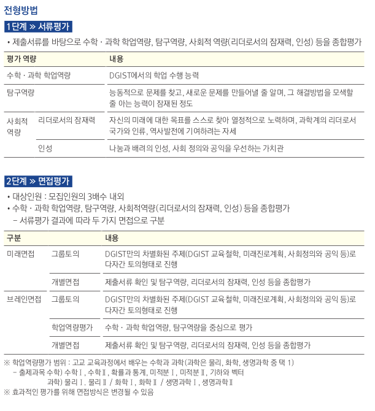
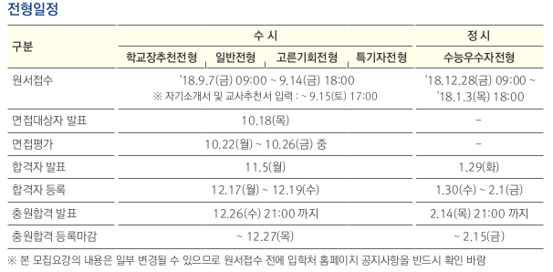
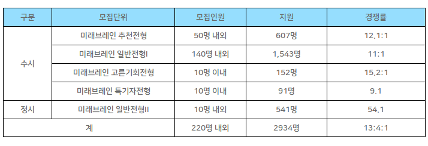

---
title: "Geonwoo"
author: [Tae Geun Kim]
date: 2018-08-30
subject: "Markdown"
keywords: [Markdown, Example]
subtitle: "For 2019"
titlepage: true
...

\newpage\null\thispagestyle{empty}\newpage

# 김건우

## 대학목록

1. 건국대학교
2. 경희대학교
3. 동국대학교
4. 숭실대학교
5. 한양대학교

\newpage

## 건국대학교

### 전형안내

전형명 | 전형방법 | 모집인원
:----: | :------: | :------:
학생부종합전형(KU자기추천) | 1단계: 서류 100%, 2단계: 서류 40% + 면접 60% | 788
학생부종합전형(KU학교추천) | 교과 40% + 서류 60% | 475

### 주의사항

* 학생부종합전형 간 중복 지원 불가

### 전형일정

구분 | 일정
:--: | :--:
원서접수 | 2018.09.10 ~ 2018.09.12
자기소개서, 교사추천서 | 2018.09.10 ~ 2018.09.13 (17:00)
1단계 합격자 발표 | 2018.10.12
면접평가 | 2018.12.01 (09:00)
최초 합격자 발표 | 2018.12.14

### 전년도 입시결과

전형 | 모집단위 | 평균 | 최저
:--: | :---: | :--: | :--:
학생부종합 (KU 자기추천) | 화학공학부 | 3.2 | 7.1
학생부종합 (KU 학교추천) | 화학공학부 | 1.5 | 2.9

\pagebreak

## 경희대학교

### 전형안내

전형명 | 전형방법 | 모집인원
:----: | :------: | :------:
학생부종합(네오르네상스) | 1단계: 서류 100%, 2단계: 서류 70% + 면접 30% | 1180
학생부종합(고교연계) | 서류 60% + 교과 40% | 800

### 전형일정

구분 | 전형일정
:--: | :------:
원서접수 | 2018.09.10 ~ 2018.09.12
자기소개서, 교사추천서 | 2018.09.10 ~ 2018.09.14 (17:00)
1단계 합격자 발표 | 2018.11.21
면접고사 | 2018.12.02
최초합격자 발표 | 2018.12.14

### 전년도 입시결과

전형 | 모집단위 | 평균 | 최저
:--: | :---: | :--: | :--:
학생부종합(고교연계) | 화학공학과 | 1.34 | 1.8 
학생부종합(고교연계) | 정보전자신소재 | 1.76 | 2.15
학생부종합(네오르네상스) | 화학공학과 | 1.82 | 1.96
학생부종합(네오르네상스) | 정보전자신소재 | 2.1 | 2.4

* 네오르네상스의 상기 등급은 합격자 중 일정 분산이상은 제거하고 구한 평균 추정치

\pagebreak

## 동국대학교

### 전형안내

전형명 | 전형방법 | 모집인원
:----: | :------: | :------:
학생부 종합(학교장추천인재) | 서류 100 | 419

### 전형일정

구분 | 전형일정
:--: | :------:
추천대상자 명단 입력 | 2018.09.03 ~ 2018.09.13 (17:00)
원서접수 | 2018.09.10 ~ 2018.09.12
자기소개서 | 2018.09.10 ~ 2018.09.13 (17:00)
최초합격자 발표 | 2018.11.20

### 전년도 입시결과

전형 | 모집단위 | 평균 | 최저
:--: | :---: | :--: | :--:
학생부 종합(학교장추천) | 융합에너지신소재공학과 | 2.10 | 2.51
학생부 종합(학교장추천) | 화공생물공학과 | 1.99 | 2.42

\pagebreak

## 숭실대학교

### 전형안내

전형명 | 전형방법 | 모집인원
:----: | :------: | :------:
학생부교과 | 학생부교과 100/ 국어, 수학 가형, 과탐 2과목 중 2개영역 합 7등급 이내 | 479

* 탐구는 2과목의 단순 평균을 의미하며 반올림하지 않음

### 전형일정

구분 | 전형일정
:--: | :------:
원서접수 | 2018.09.10 ~ 2018.09.14
최초합격자 발표 | 2018.12.14

### 학생부 반영방법

구분 | 국어 | 수학 | 영어 | 과학
:--: | :--: | :--: | :--: | :--:
자연계열 | 15 | 35 | 25 | 25

### 전년도 입시결과

* 2015년도까지가 교과우수자 전형 선발이었기에 2012 ~ 2015 결과만 기재하겠음. 2014년은 교과별 3개만을 평가하였기에 단순비교가 불가하여 기재하지 않음.

전형 | 모집단위 | 평균
:--: | :---: | :--:
교과(2015) | 유기신소재,파이버공학과 | 2.0
교과(2013) | 유기신소재,파이버공학과 | 2.2
교과(2012) | 유기신소재,파이버공학과 | 2.2

\pagebreak

## DGIST

### 전형안내

* 위 전형방법은 학교장추천, 일반전형 모두에 해당.

\pagebreak

### 전형일정

### 전년도 경쟁률

