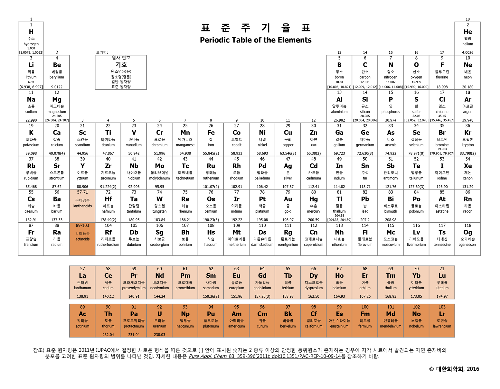

# 1. Cosmology (우주론)

### 1) 빅뱅 우주론

#### - History

1. 아인슈타인 - 정적 우주론 제창
2. 프리드만 - 아인슈타인의 일반상대론에 의거하여 동적 우주론 주장
3. 허블 - 허블의 법칙 발견 (멀리 있는 은하가 더 빠르게 멀어 진다.) → 우주 팽창의 증거 (동적 우주론 인정)
4. 가모프 - 빅뱅 우주론 주장 vs 호일 - 정상 우주론
5. 펜지어스와 윌슨 - 우주배경복사 관측 → 빅뱅 우주론의 증거

---

#### - 기본 입자

**1. 쿼크**
: 양성자와 중성자를 이루는 가장 기본이 되는 입자로 자연계에 6종류가 존재한다. 항상 3개의 입자가 쌍을 이뤄 존재한다.

* Up 쿼크 : 전하량 +2/3 을 가지며 Down 쿼크보다 미세하게 가볍다.
* Down 쿼크 : 전하량 -1/3을 가지며 Up 쿼크보다 미세하게 무겁다.

양성자는 uud, 중성자는 udd의 배열을 가진다.

**2. 경입자 (Lepton)**
: 쿼크와 마찬가지로 자연계에 존재하는 가장 기본적인 입자 중 하나로 그 자체로 기본입자이다. 쿼크와 비슷하게 종류는 6가지이다. 전자, 뮤온, 타우 가 존재하며 각각의 입자들에 중성미자가 존재한다.

---

#### - 강입자 (Hadron)

**1. 양성자 & 중성자 (Proton & Neutron)**
: 강력의 지배를 받는 입자들을 강입자라고 하며 크게 양성자와 중성자가 존재한다. 양성자와 중성자는 글루온(gluon)이라는 입자를 매개체로 하여 강한핵력으로 결합하여 원자핵을 구성한다. 이때, 통상적으로 원자번호는 양성자의 수에 의해 결정되며 중성자의 수에 따라 동위원소들을 분류한다. 위에서 말했듯이 중성자가 양성자보다 조금 더 가벼우므로 중성자는 양성자로 붕괴할 수 있다.

$$ n^0 \rightarrow p^+ + e^- + \bar{\nu}_e $$

이러한 붕괴과정을 β-붕괴라고 부르며 구체적으로는 중성자가 양성자 및 전자, 전자 중성미자가 되는 과정을 뜻한다. 이 과정에서 작용하는 힘을 약한 상호작용이라고 부른다.

★ 양성자는 **수소 원자핵**이라고도 부른다.

---

#### - 원자핵 (Nucleus)

**1. 수소 원자핵**
: 일반 수소의 경우 양성자를 일컫는다. 중성자가 첨가된 중수소 원자핵이나 중성자가 두 개 첨가된 삼중수소 원자핵도 존재한다. (이를 동위원소라고 부른다.)

**2. 헬륨 원자핵**
: 양성자 2개, 중성자 2개가 결합하여 총 4개의 입자가 한데 만나 결합되어 있는 상태를 헬륨 원자핵이라고 부른다. 별에서의 핵융합으로도 만들어지나, 여기서의 초점은 빅뱅 핵합성이다. 초기 우주에서 중수소 원자핵과 삼중수소 원자핵이 생성되어 충돌하면 헬륨원자핵이 생성된다.

---

#### - 우주배경복사 (Cosmic Microwave Background)

플라즈마 단계의 우주에서는 빛이 원자핵과 전자에 의해 산란되어 멀리까지 전달되지 못했지만 이후 원자핵과 전자가 전자기력에 의해 중성원자를 이루면서 투명한 우주가 되자 빛이 우주로 퍼져나갈 수 있었다. 이윽고, 우주가 팽창하면서 빛의 파장이 무지막지하게 늘어났고 낮은 에너지 덕에 상호작용을 하지 않고 남아있다가 펜지어스와 윌슨에 의해 관측되었다. 

기본적으로 모든 방향에서 동일한 세기로 관측되며 빅뱅 우주론에서 예측한 온도와 정확히 일치하기 때문에 빅뱅우주론의 강력한 증거로 여겨진다.

---

#### - 빅뱅 우주론의 과정

1. 빅뱅
2. 온도가 낮아지면서 쿼크와 경입자(Lepton)이 생성되고 입자와 그에 상응하는 반입자도 생성되었다.
3. 우주의 온도가 더욱 낮아지면서 강력에 의해 쿼크가 결합하여 양성자와 중성자가 생성되었다.
4. 빅뱅 이후 1초 ~ 3분 사이에 중성자가 양성자로 붕괴되며 개수비가 약 7:1 (양성자:중성자)이 되었다.
5. 빅뱅 이후 3분이 되었을 때, 빅뱅 핵 합성에 의해 헬륨 원자핵이 생성되었다.
6. 3분이 지난 후, 우주의 온도가 10억 K이하로 낮아지면서 핵합성이 중단되었다. 이떄, 수소 원자핵과 헬륨 원자핵의 질량비는 3:1이 되었다.
7. 빅뱅 이후 38만년 후, 우주의 온도가 3000K가 되자 중성원자가 생겨났고 우주배경복사가 우주로 퍼져나가기 시작했다.
8. 현재는 약 3K의 우주배경복사가 우주를 가득 메우고 있다.

---

#### - 보충 개념 (Supplement 1)

**- 스펙트럼**
: 원자의 양자역학적 구조 (특정 준위에만 존재) 로 인해 특정 파장의 빛을 흡수하거나 방출하면서 나타나는 현상.

1. 연속 스펙트럼: 고온의 별에서 방출되는 빛은 연속으로 나타난다.
2. 선 스펙트럼: 고온의 기체에서 방출되는 빛은 검은 바탕에 여러 개의 밝은색 방출선이 나타난다.
3. 흡수 스펙트럼: 저온의 기체에서 흡수되는 빛은 연속 스펙트럼 위에 검은색 흡수선으로 나타내어진다.

스펙트럼으로 알 수 있는 것에는 원소의 종류 및 질량비가 있다.

**- K (Kelvin)**
: 온도의 단위로 절대온도라고 부른다. 기체의 부피가 이론상 0이 되는 지점을 0K으로 지정하고 섭씨(Celcius)와 같은 간격을 사용한다. 따라서 절대온도는 섭씨온도에 273도를 더한 것이 된다.

---

### 2) 항성 진화론 (Stellar Evolution)

#### - 원시별 (Primodial Star)

: 가스 구름들이 중력에 의해 뭉쳐서 만들어진 성운에서 원시별들이 탄생한다. 특히 성운 안에서도 밀도가 높고 온도가 낮은 곳에서는 물질들이 많이 뭉치는데 여기서 원시별이 탄생한다.

★ 원시별은 스스로 핵융합을 할 수 없기에 별이라고 하지 않는다.

---

#### - 주계열성 (Main Sequence Stars)

* 중심에서 수소 핵융합을 하는 시기 - 내부온도는 1000만 K
* 별에서 가장 풍부한 원소가 수소이므로 별의 일생 중 가장 오래 가는 시기

---

#### - 적색 거성 (Red Giant Branch)

* 중심에서는 헬륨 핵융합(1억 K)이 일어나 탄소가 만들어지고 주변부는 수소 핵융합을 하는 시기
* 에너지가 많이 방출되므로 별의 크기가 매우 크며, 수명은 짧다.
* 많이 팽창했으므로 표면 온도는 매우 낮아 붉은색이다.

---

#### - 백색 왜성 (White Dwarf)

: 적색 거성의 중심부에서 헬륨이 모두 탄소로 전환되면 중심은 더 이상 에너지를 방출하지 않기 떄문에 수축하게 되고, 이때 발생한 열이 주변부를 데우면서 수소 핵융합이 활발히 일어나 주변부는 모두 밖으로 날아가게 되고 (행성상 성운), 중심부는 더욱 수축하여 탄소로 이루어진 백색 왜성이 된다.

---
#### - 태양 질량 별의 진화

1. 원시별이 수축하여 내부의 온도가 1000만K 정도 되면 수소 핵융합을 하기 시작하는 주계열성이 된다.
2. 중심에서의 수소가 모두 소진되면 중력에 의해 수축하게 된다.
3. 중력 수축으로 인하여 내부 온도가 1억 K에 도달하여 중심에서는 헬륨 핵융합 (He → C) 이 일어나고 주변부에서는 수소 핵융합이 일어나는 적색 거성이 된다.
4. 적색 거성은 빠르게 진화하므로 중심의 헬륨이 모두 소진되어 중심부와 주변부가 분리되고 각각 백색왜성과 행성상 성운이 된다.

---

#### - 초거성 (Hyper Giant Branch)

: 질량이 태양보다 10배 이상 큰 별은 중력이 훨씬 강하기에 크기도 더 크고 질량도 더 무거운 초거성으로 진화하게 된다. 적색 거성과 헬륨 핵융합 단계 까지는 유사하지만 헬륨 소진 이후에도 강력한 중력으로 더욱 내부온도를 높여 탄소에서부터 철까지 중심부에서 생성할 수 있다. 에너지가 워낙 빠르게 방출되므로 적색 거성보다도 더욱 빠르게 진화한다.

---

#### - 초신성 폭발 (Super Nova)

: 초거성의 중심부에 철이 만들어지게 되면 더 이상 중심부에서 핵융합이 일어나지 않기 때문에 중심부가 급격하게 수축하게 된다. 이때, 수축의 속도는 초음속이므로 충격파(Sonic Wave)가 발생하는데 이로 인해 주변부에서는 연쇄적인 핵융합반응이 매우 빠르게 일어나게 된다. 이에 주변부에서 대규모 폭발이 발생하고 매우 빠른 속도로 외부로 날아가게 된다. 이를 초신성 폭발이라고 부르며 초신성 폭발의 밝기는 은하계 모든 별의 밝기를 합한 것보다도 밝다. 

초신성 폭발은 엄청난 양의 에너지가 발생하는데, 이 에너지에 의해 수 초 만에 핵융합 반응이 한꺼번에 일어나 철보다 무거운 구리, 금, 납, 우라늄 등의 원소가 생성된다.

---

#### - 중성자별 & 블랙홀 (Neutron Star & Black Hole)

: 초거성의 주변부는 초신성 폭발로 날아가게 되고 중심부는 극한까지 수축하여 질량에 따라 중성자별이나 블랙홀이 된다. 중성자별은 거의 대부분이 빈공간인 원자와 다르게 밀도가 매우 높아서 적은 부피로도 엄청난 질량을 지닌다. 블랙홀은 중성자별보다도 중력이 강력하여 빛 조차도 나오지 못하게 하는 천체이다. 보통 은하계 중심에 거대한 블랙홀이 있을 것이라 추측된다.

---

#### - 질량이 태양보다 훨씬 큰 별의 진화

1. 원시별이 수축하여 주계열성이 된다.
2. 태양 질량 별보다 빠르게 에너지를 방출하여 주계열성에서 초거성으로 넘어가게 된다.
3. 초거성에서 철 까지 핵융합을 마친 후 초신성 폭발을 하여 중심부는 중성자별이나 블랙홀, 주변부는 우주로 날아가게 된다.

---

#### - 보충 개념 (Supplement 2)

**- 리튬 (Lithum)**
: 원자 번호 3번인 리튬은 마치 철 이상의 원소 처럼 통상적인 핵융합으로는 생성되지 않는다. 이런 원소들은 핵융합이 한꺼번에 일어나는 과정에서 만들어지는데, 따라서 빅뱅 핵합성이나 초신성 폭발에서만 생성된다.

**- 원소 생성 정리**

* 탄소와 질량이 같거나 가벼운 원소: 적색 거성 및 초거성에서 생성
* 철과 질량이 같거나 가벼운 원소: 초거성에서 생성
* 철보다 무거운 원소: 초신성 폭발에서 생성

---

### 3) 태양계 (Solar System)

#### - 원시 태양계

**- 성운설**
: 성운설이란 태양계의 기원을 설명한 가설 중 가장 유력하게 여겨지는 것으로 원시 태양계 성운의 회전과 수축을 통해 태양계의 모든 천체들이 함께 만들어졌다는 가설이다.

**- 태양계 형성 과정**

1. 태양계 자리에 있었던 성운은 초기 우주에서 만들어진 수소, 헬륨, 탄소, 질소, 산소, 철 등의 무거운 원소도 포함되어 있었다. 약 50억년 전에 주변에서 일어난 초신성 폭발로 인해 수축하기 시작하면서 태양계 성운을 형성하였다.
2. 태양계 성운은 회전하면서 중력에 의해 수축하여 중심부는 볼록하고 가장자리는 얇은 원반 모양을 이루게 되었다.
3. 중심부는 중력으로 더욱 밀집하여 원시 태양이 형성되고 주변부는 여러 개의 큰 고리가 되었고, 각 고리를 구성하는 가스와 먼지도 각각 뭉쳐서 미행성체들이 형성되었다.
4. 미행성체들은 원시 태양 주위를 회전하면서 서로 충돌하여 원시 행성이 되었고, 원시 행성은 주변의 물질들을 끌어당겨 현재의 행성이 되었다.
5. 원시 태양 중심부에서 수소 핵융합이 일어나기 시작하면서 태양이 되었고, 태양이 방출하는 강력한 태양풍에 의해 행성 주변의 가스와 먼지들이 태양계 밖으로 밀려나면서 현재의 태양계가 형성되었다.

---

#### - 지구형 행성

* 태양계 원반에서 태양과 가까운 곳은 온도가 높아서 철, 니켈, 규소와 같은 녹는점이 높고 무거운 물질들이 남아 미행성체를 형성 → 암석 성분의 지구형 행성들이 형성
* 주로 철과 니켈로 이루어진 중심핵을 규산염 암석으로 이루어진 맨틀이 둘러싸고 있다.

---

#### - 목성형 행성

* 태양계 원반에서 멀리 떨어진 곳은 온도가 낮아서 녹는점이 낮은 얼음이나 메테인 등이 응축되어 미행성체를 형성 → 기체 성분의 목성형 행성들이 형성
* 암석이나 얼음으로 이루어진 핵을 금속성 수소 또는 얼음층이 둘러싸고, 그 밖을 분자 수소가 둘러싸고 있다.

---

#### - 지구의 형성과정

1. 미행성체의 충돌: 미행성체의 충돌에 의해 원시 지구가 형성되고, 계속된 충돌로 지구의 크기와 질량 증가
2. 마그마의 바다: 지속된 충돌로 인하여 온도가 매우 높아지고 지구 전체가 거의 녹아 있는 마그마의 바다를 형성
3. 맨틀과 핵의 분리: 마그마의 바다에서 철과 니켈 등 무거운 물질은 중력에 의해 지구 중심부로 가라앉아 핵을 이루고, 상대적으로 가벼운 규소나 산소 등의 물질은 위로 올라와서 맨틀을 이루었다.
4. 원시 지각의 형성: 미행성체의 충돌이 점차 줄어들어 지표면이 냉각된 지구는 원시 지각을 형성
5. 원시 바다의 형성: 지표면의 온도가 낮아지면서 대기 중의 수증기가 응결하여 비가 내리고 원시 바다가 형성
6. 최초의 생명체 탄생: 지속된 번개로 인해 풍부한 영양소가 생성되고 단백질 등이 생성되며 최초의 생명체가 탄생하였다.

---

#### - 지구의 구성원소

* 지각에 가장 많은 원소는 산소이고 두번째는 규소이다.
* 지구 전체에서 가장 많은 원소는 철이며 중심에 대부분 존재한다.
* 지구의 대기는 질소가 가장 많고 다음으로 산소가 많다.

---

# 2. Periodic Table (주기율표)

### 1) 원소 (Elements)

#### - 용어 정리

* 원소: ~~물질을 구성하는 기본 성분으로 더 이상 다른 물질로 분해되지 않는다.~~ 하지만 원자의 구조가 밝혀지면서 원소는 원자핵을 이루는 양성자 수가 같은 입자로 이루어진 물질을 뜻하게 되었다.
* 분자: 물질의 성질을 결정하는 가장 작은 단위 (원자 자체는 분자의 성질을 갖지 않는다.)

> 예시: $H_2O$는 물 분자이며 이를 이루는 원소는 수소(H)와 산소(O)이며 수소 원자 2개와 산소 원자 1개로 구성되어 있다.

---

#### - 원소의 분류 역사

1. 되베라이너: 화학적 성질이 비슷한 3개의 원소들의 원자량 사이에 일정한 관계가 있다는 것을 발견. 이를 세 쌍 원소라고 하며, 족의 개념의 시초가 되었다.
2. 뉴랜즈: 원소들을 원자량 순서대로 배열하면 음악의 옥타브처럼 8번째 원소마다 성질이 비슷한 원소가 나타나는 것을 발견하고, 이를 '옥타브 설'이라고 하였다. 이는 주기율의 개념적 토대가 되었다.
3. 멘델레예프: 63종의 원소를 원자량이 증가하는 순서에 따라 배열하면 성질이 비슷한 원소들이 주기적으로 나타나는 현상을 발견하였으며, 이를 바탕으로 주기율표를 만들었다.
4. 모즐리: 양성자 수에 따라 원소들의 원자번호를 정하였다. 원소들을 원자량이 아닌 원자 번호 순서대로 배열한 주기율표를 만들었다.

---

#### - 주기율표

* 주기: 주기율표에서 가로 줄을 주기라고 한다.
* 족: 주기율표에서 세로 줄을 족이라고 하며, 같은 족의 원소들은 화학적 성질이 비슷하므로 동족 원소라고 부른다.

---

#### - 금속 원소

* 주기율표의 왼쪽과 가운데에 위치한다.
* 대부분의 금속 원소는 전자를 잃고 양이온이 되기 쉽다.
* 수은(Hg)을 제외한 모든 금속은 실온(25°C)에서 고체 상태로 존재한다.
* 금속 원소마다 특유한 광택이 존재한다.
* 금속은 열 전도성과 전기 전도성이 높다.
* 금속은 잘 늘어나거나 잘 펴지는 성질이 있다.

---

#### - 비금속 원소

* 수소(H)를 제외한 비금속 원소는 주기율표의 오른쪽에 위치하며, 금속 원소와는 전혀 다른 성질을 가진다.
* 대부분의 비금속 원소는 전자를 얻어 음이온으로 되기 쉽다.
* 비금속 원소는 대부분 실온에서 기체나 고체 상태로 존재한다. 유일하게 브로민 만이 실온에서 액체상태이다.
* 고체 상태의 비금속 원소는 광택을 내지 않는다.
* 탄소를 제외한 대부분의 비금속 원소는 열이나 전기 전도성이 낮다.
* 비금속 원소는 잘 펴지거나 늘어나지 않으며 쉽게 부스러진다.

---

#### - 준금속 원소

* 준금속 원소는 주기율표에서 금속 원소와 비금속 원소의 경계 부분에 위치한다.
* 금속과 비금속의 모든 성질을 가지거나 중간 성질을 가진다.
* 도체인 금속과 부도체인 비금속의 성질을 반씩 가지므로 반도체의 재료로 많이 사용된다.

---

#### - 원자와 주기율표

**- 원자의 구성 입자**

* 원자의 중심에는 얀전하를 띠는 원자핵이 있고, 그 주위에 음전하를 띠는 전자가 분포한다.
* 원자는 양성자 수와 전자 수가 같으므로 전기적으로 중성이다.
* 원자에서의 양성자 수를 원자 번호라고 부르며 양성자 수와 중성자 수를 더한 것을 질량 수 혹은 원자량이라고 부른다.

**- 전자 배치**

* 전자 껍질: 원자에서 전자가 존재하는 특정한 에너지를 가진 궤도로, 원자핵에 가까울 수록 에너지가 낮다.
* 전자 배치의 원리
  1. 쌓음 원리: 에너지가 낮은 전자껍질부터 전자가 채워진다.
  2. 옥텟 규칙: 첫 번째 껍질에는 2개, 이후 껍질 부터는 8개까지 전자가 들어갈 수 있다.

**- 원자가 전자**

* 원자의 전자 배치에서 가장 바깥 전자 껍질에 존재하는 전자
* 화학 결합에 참여하므로 원자가 전자 수에 따라 원소들의 화학적 성질이 결정된다.

**- 전자 배치의 주기성**

* 같은 주기 원소들은 같은 껍질 수를 가진다.
* 같은 족 원소들은 원자가 전자 수가 같아 화학적 성질이 비슷하며 각 족의 원소들의 워나작 전자 수는 족 번호의 끝 자리 수와 같다. (ex: 산소는 8번이므로 원자가 전자가 6개이고 16족에 속한다.)
* 단, 18족 원소는 화학 결합을 하지 않으므로 원자가 전자 수가 0이다.

---

#### - 알칼리 금속

**- 물리적 성질**
* 실온에서 고체 상태이며 은백색 광택이 있다.
* 칼로 쉽게 잘릴 정도로 무르다.
* 다른 금속에 비해 밀도가 매우 작다. 특히 리튬, 나트륨, 칼륨은 밀도가 물보다 작아 물 위에 뜬다.

**- 화학적 성질**
* 주기율표의 1족에 속하는 금속 원소로 원자가 전자 수가 1개이다. (수소는 비금속이므로 제외)
* 알칼리 금속은 반응성이 매우 커서, 물, 산소, 할로젠 등등 여러 원소와 아주 쉽게 반응한다.
* 알칼리 금속은 물과 반응하여 수소 기체를 발생하고, 반응 후 수용액은 염기성을 나타낸다.

$$
2Na + 2H_2O \rightarrow 2Na^+OH^- + H_2 
$$

* 알칼리 금속은 공기 중의 산소와 반응하여 산화물을 형성하기 때문에 공기 중에 두면 광택을 쉽게 잃는다.

$$
4Na + O_2 \rightarrow 2Na_2O
$$

* 알칼리 금속은 원자 번호가 클수록 반응성이 커진다. 

---

#### - 할로젠

**-물리적 성질**
* 할로젠은 2개의 원자가 결합한 이원자 분자($F_2,Cl_2,Br_2,I_2$)로 존재한다.
* 할로겐은 종류에 따라 독특한 색깔을 띠는데, 그 색깔은 다음과 같다.

플루오린 | 염소 | 브로민 | 아이오딘
:---: | :---: | :---: | :---:
엷은 황색 | 황록색 | 적갈색 | 흑자색

* 할로젠은 원자 번호가 증가할수록 녹는점과 끓는점이 높아진다. 실온에서의 상태는 다음과 같다.

플루오린 | 염소 | 브로민 | 아이오딘
:---: | :---: | :---: | :---:
기체 | 기체 | 액체 | 고체

* 비금속 원소이므로 열과 전기 전도성이 거의 없다.

**- 화학적 성질**
* 주기율표의 17족에 속하며 원자가 전자 수가 7이다.
* 할로젠은 물에 거의 녹지 않거나 매우 조금 녹는다.
* 할로젠은 비금속 원소 중 반응성이 크며 금속과 반응하여 염을 만든다.
* 할로젠은 수소를 비롯한 비금속 원소와도 반응하여 화합물을 만든다. 할로젠 원소와 수소가 만나 할로젠화 수소를 이루면 그 물질은 모두 산성을 띤다. $HF$만이 약한 상성을 띠고 $HCl,~HBr,~HI$ 는 모두 강한 산성을 띤다.
* 할로젠은 원자번호가 작을수록 반응성이 커진다.

---

#### - 보충 개념 (Supplement 3)

**- 산, 염기**
: 물과 반응하여 수소이온($H^+$)를 내놓으면 산이고, 수산화이온($OH^-$)을 내놓으면 염기이다.

**- 알칼리와 할로젠의 반응성 규칙이 반대인 이유**
: 알칼리는 전자를 잃음으로서 양이온이 되는데 원자핵으로부터 거리가 멀 수록 (전자 껍질이 많을 수록) 전자를 분리하는 것이 더욱 쉽다. 따라서 원자 번호가 증가할수록 반응성이 커진다. 반면, 할로젠은 전자를 얻음으로서 음이온이 되는데 이는 원자핵과 가까울수록 (전자 껍질이 적을 수록) 지나가는 전자를 포획하기 쉬워진다. 따라서 원자번호가 작을 수록 반응성이 크다.
